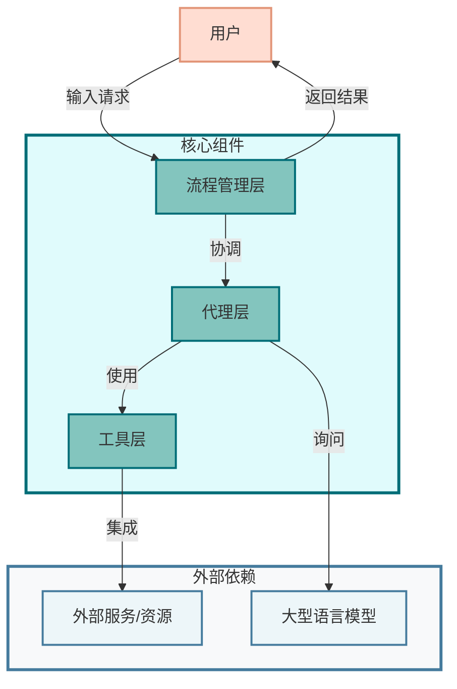
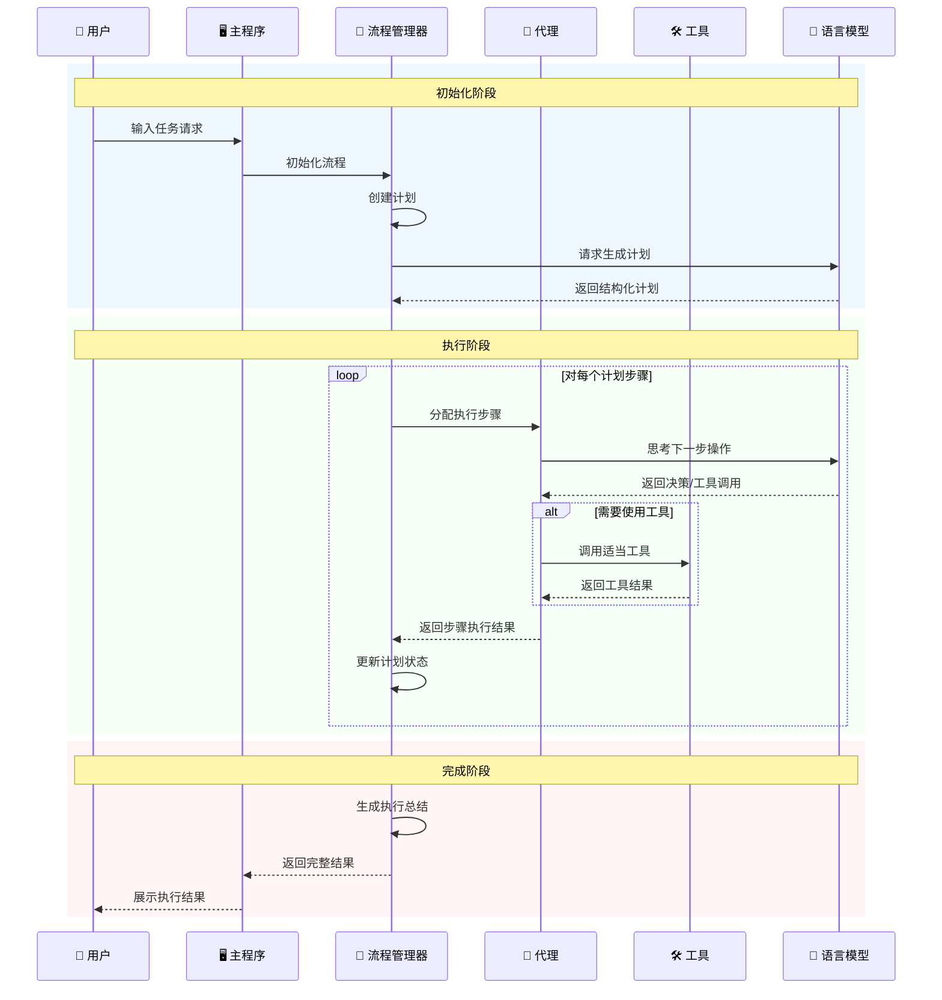
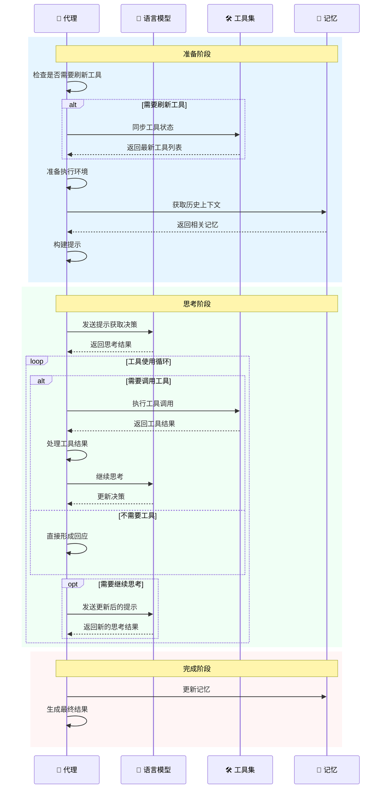
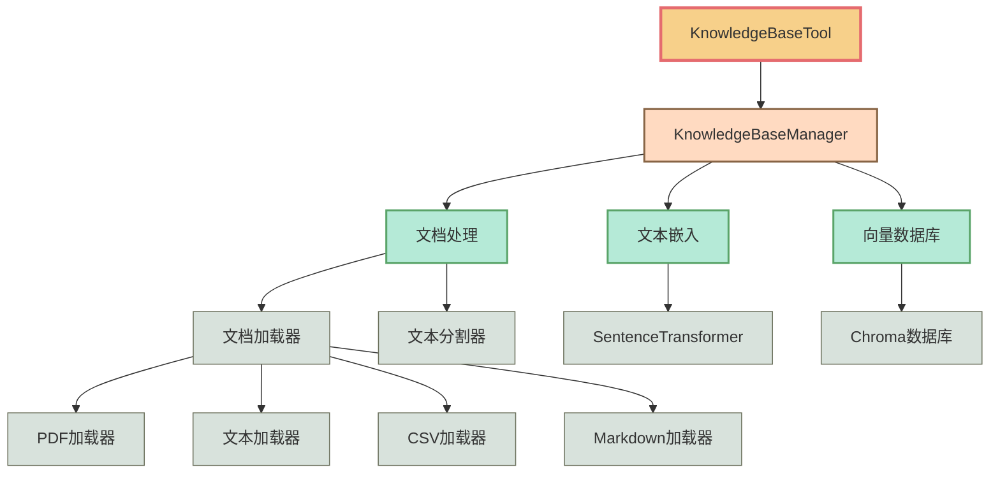

# OpenManus源码浅析 & RAG工具实现

## 目录
1. [项目概述](#项目概述)
2. [系统架构](#系统架构)
3. [关键组件](#关键组件)
4. [执行流程](#执行流程)
5. [多代理协作机制](#多代理协作机制)
6. [工具系统](#工具系统)
7. [扩展RAG工具：KnowledgeBaseTool](#rag工具实现knowledgebasetool)
8. [部署与使用](#部署与使用)

## 概述

OpenManus 是一个由 MetaGPT 团队开发的开源项目，旨在实现商业 AI Agent 系统 Manus 的核心功能和架构。项目源地址：https://github.com/mannaandpoem/OpenManus

该框架采用了模块化设计，通过集成大型语言模型(LLM)、功能丰富的工具集（包括浏览器操作工具、Python 执行工具、MCP 工具等）以及出色的流程管理系统，构建了一个完整的Agent系统。这一系统能够有效地解析用户需求、自主规划任务步骤、协调多代理协作，并通过工具调用执行复杂任务。

通过分析 OpenManus 源码，可以发现其包含了多种优秀的软件工程和提示词工程实践。项目采用了一系列设计模式，为Agent的任务规划、异常处理、工具调用及结果处理提供了良好的基础。同时，OpenManus 展现出良好的扩展性，本文后续将演示如何为其扩展 RAG (Retrieval-Augmented Generation) 工具，赋予系统管理和查询本地知识库的能力。

接下来，本文将按照以下阅读顺序浅析项目源码：

1. **核心数据结构**
    - app/schema.py - 核心数据结构定义，包括消息类型、工具调用、内存管理等
    - app/config.py - 配置管理
2. **Agent基础架构**
    - app/agent/base.py - Agent基类，所有Agent的基础架构
    - app/agent/react.py - ReAct模式实现，思考-行动循环
    - app/agent/toolcall.py - 工具调用Agent实现，核心功能
3. **核心功能实现**
    - app/llm.py - LLM集成和交互实现
    - app/agent/manus.py - Manus Agent实现，主要入口点
    - app/agent/mcp.py - MCP Agent实现
4. **工具实现**
    - app/tool/__init__.py - 工具基础定义
    - app/tool/base.py - 工具抽象基类
    - app/tool/tool_collection.py - 工具集合
    - 其他具体工具类（python_execute.py, browser_use_tool.py, str_replace_editor.py等）
5. **流程管理**
    - app/flow/base.py - 流程基类
    - app/flow/flow_factory.py - 流程工厂
    - app/flow/planning.py - 计划流程实现
6. **入口文件**
    - main.py - 主入口
    - run_mcp.py - MCP模式入口
    - run_flow.py - Flow模式入口
7. **提示词模板**
    - app/prompt/ 目录下的各种提示词模板文件
8. **高级功能和扩展**
    - app/sandbox/ - 沙盒环境
    - app/mcp/ - MCP相关实现

## 源码解析

OpenManus 采用模块化、分层设计，具有高度的可扩展性和灵活性。



### 架构层次

1. **流程管理层 (Flow)**
   - 负责协调整体执行流程
   - 管理多代理之间的交互
   - 实现不同执行模式（如规划流、顺序流）

2. **代理层 (Agent)**
   - 封装智能体的核心行为
   - 与LLM交互获取决策
   - 管理代理的状态和记忆

3. **工具层 (Tool)**
   - 提供可被代理调用的各种工具
   - 定义统一的工具接口标准
   - 实现具体功能（如Python执行、浏览器操作、知识库查询）

4. **集成层**
   - 连接外部服务和资源
   - 包括LLM接入、文件系统访问等

## 关键组件

### 1. 代理系统

代理是OpenManus的核心执行单元，具有思考、决策和使用工具的能力。

#### 基础代理 (BaseAgent)

所有代理的抽象基类，定义了代理的基本接口和行为：

```python
class BaseAgent:
    """Base class for all agents"""

    async def run(self, prompt: str) -> str:
        """Run the agent with the given prompt"""
        pass

    async def cleanup(self) -> None:
        """Clean up any resources used by the agent"""
        pass
```

#### 工具调用代理 (ToolCallAgent)

能够使用工具的代理，继承自BaseAgent，实现了工具调用逻辑：

```python
class ToolCallAgent(BaseAgent):
    """Agent that can use tools via LLM tool calls"""

    async def think(self, messages: List[Message]) -> AgentResponse:
        """Core thinking logic using LLM"""
        pass
```

#### Manus代理

项目的主要代理实现，继承自ToolCallAgent，增加了特定功能：

```python
class Manus(ToolCallAgent):
    """Main agent implementation with enhanced capabilities"""

    async def initialize_helper(self) -> None:
        """Initialize helper components like browser context"""
        pass
```

### 2. 流程系统

流程系统负责协调代理的执行，并实现复杂的任务管理。

#### 基础流程 (BaseFlow)

所有流程的抽象基类：

```python
class BaseFlow:
    """Base class for all execution flows"""

    async def execute(self, input_text: str) -> str:
        """Execute the flow with the input text"""
        pass
```

#### 规划流程 (PlanningFlow)

实现了基于计划的任务执行流程：

```python
class PlanningFlow(BaseFlow):
    """A flow that manages planning and execution of tasks using agents"""

    async def _create_initial_plan(self, request: str) -> None:
        """Create an initial plan based on the request"""
        pass

    async def _execute_step(self, executor: BaseAgent, step_info: dict) -> str:
        """Execute a single step of the plan"""
        pass
```

#### 流程工厂 (FlowFactory)

负责创建不同类型的流程：

```python
class FlowFactory:
    """Factory for creating different types of flows"""

    @staticmethod
    def create_flow(flow_type: FlowType, agents: Union[BaseAgent, List[BaseAgent], Dict[str, BaseAgent]], **kwargs) -> BaseFlow:
        """Create a flow instance based on the specified type"""
        pass
```

### 3. 工具系统

工具系统提供了代理可以使用的各种能力接口。

#### 基础工具 (BaseTool)

所有工具的抽象基类：

```python
class BaseTool:
    """Base class for all tools"""

    async def execute(self, **kwargs) -> ToolResult:
        """Execute the tool with the specified parameters"""
        pass

    def to_param(self) -> Dict[str, Any]:
        """Convert the tool to a parameter format for LLM"""
        pass
```

#### 工具集合 (ToolCollection)

管理多个工具的集合：

```python
class ToolCollection:
    """A collection of tools that can be used by agents"""

    def register(self, tool: BaseTool) -> None:
        """Register a tool in the collection"""
        pass

    async def execute_tool(self, tool_name: str, **kwargs) -> ToolResult:
        """Execute a specific tool by name"""
        pass
```

## 执行流程

OpenManus 的执行流程展示了从用户输入到最终结果的完整路径：



### 执行模式

OpenManus 支持两种主要执行模式：

1. **直接执行模式 (main.py)**
   - 单代理模式，直接使用Manus代理执行任务
   - 简单直接，适合快速测试和单一任务

2. **工作流执行模式 (run_flow.py)**
   - 使用流程系统协调多代理执行
   - 支持复杂的任务规划和步骤执行
   - 提供超时控制和执行统计

### 单步执行流程

以下是代理执行单个步骤的详细流程：



## 多代理协作机制

OpenManus 的一个核心特性是支持多代理协作，这通过流程系统实现：

### 代理分工

在PlanningFlow中，代理可以根据步骤类型分配不同的任务：

```python
def get_executor(self, step_type: Optional[str] = None) -> BaseAgent:
    """获取适当的执行器代理"""
    if step_type and step_type in self.agents:
        return self.agents[step_type]

    # 使用默认执行器
    for key in self.executor_keys:
        if key in self.agents:
            return self.agents[key]

    return self.primary_agent
```

### 专家角色

系统支持不同代理扮演不同专家角色：

- 规划专家：负责任务分解和计划生成
- 执行专家：负责具体步骤实现
- 领域专家：在特定领域提供专业知识

## 工具系统

OpenManus的工具系统是其核心能力的基础，提供了多种工具：

### 内置工具

1. **Python执行工具 (PythonExecute)**
   - 允许执行Python代码
   - 实现轻量级沙箱隔离

2. **浏览器工具 (BrowserUseTool)**
   - 提供网页浏览和交互能力
   - 支持导航、点击、读取内容等操作

3. **规划工具 (PlanningTool)**
   - 支持创建和管理结构化计划
   - 跟踪计划执行进度

### 工具接口标准

所有工具遵循统一的接口标准，便于扩展：

```python
async def execute(self, **kwargs) -> ToolResult:
    """执行工具功能"""
    pass
```

工具结果使用`ToolResult`类表示，可以包含输出、错误信息等：

```python
class ToolResult:
    """工具执行结果"""
    output: Optional[str] = None
    error: Optional[str] = None
```

## RAG工具实现：KnowledgeBaseTool

OpenManus 的一个重要创新是添加了 KnowledgeBaseTool，这是一个强大的本地知识库管理和查询工具。

### 实现原理

KnowledgeBaseTool 建立在现代文本嵌入和向量数据库技术之上，主要包含以下核心组件：



#### 1. KnowledgeBaseManager

负责核心功能实现，包括：

- 文档加载和处理
- 文本向量化
- 索引创建和管理
- 相似性搜索

```python
class KnowledgeBaseManager:
    """负责管理本地知识库操作"""

    def __init__(self, base_path: Optional[str] = None):
        # 初始化文本嵌入模型
        self.model = SentenceTransformer("all-MiniLM-L6-v2")

        # 索引存储
        self.loaded_indexes = {}

        # 文本分割器
        self.text_splitter = RecursiveCharacterTextSplitter(
            chunk_size=1000,
            chunk_overlap=200,
        )
```

#### 2. 文档处理流程

文档处理涉及以下步骤：

1. **加载文档**：使用适当的加载器读取不同格式的文档
2. **分割文本**：将长文档分割成适当大小的文本块
3. **生成嵌入**：将文本块转换为向量表示
4. **存储索引**：将向量和原始文本保存到Chroma数据库

```python
def create_index(self, source_path: str, index_name: Optional[str] = None) -> str:
    """创建新的向量索引"""
    # 加载文档
    documents = self._load_documents(Path(source_path))

    # 创建嵌入函数
    embedding_function = lambda texts: self.model.encode(
        texts, normalize_embeddings=True
    )

    # 创建Chroma集合
    chroma_db = Chroma.from_documents(
        documents=documents,
        embedding=embedding_function,
        persist_directory=str(index_dir),
        collection_name=index_id
    )
```

#### 3. 查询机制

查询过程利用向量相似性来找出与问题语义最相关的文本：

```python
def query(self, index_id: str, query: str, top_k: int = 5) -> List[Dict[str, Any]]:
    """查询索引"""
    # 加载索引
    chroma_db = self.loaded_indexes[index_id]

    # 执行相似性搜索
    results = chroma_db.similarity_search_with_relevance_scores(query, k=top_k)

    # 格式化结果
    formatted_results = []
    for doc, score in results:
        formatted_results.append({
            "content": doc.page_content,
            "metadata": doc.metadata,
            "score": float(score)
        })
```

#### 4. 工具接口

KnowledgeBaseTool 提供了四个主要命令：

```python
async def execute(
    self,
    command: str,  # "create_index", "list_indexes", "query", "delete_index"
    source_path: Optional[str] = None,
    index_name: Optional[str] = None,
    index_id: Optional[str] = None,
    query_text: Optional[str] = None,
    top_k: int = 5,
    **kwargs
) -> ToolResult:
    """执行知识库工具命令"""
```

### 技术优势

KnowledgeBaseTool 带来的核心优势：

1. **语义理解**：基于文本嵌入的搜索超越了传统关键词匹配，能够理解查询的语义意图。

2. **多格式支持**：统一处理多种文档格式，包括PDF、文本、CSV、Markdown等。

3. **本地化**：所有数据和处理都在本地完成，保证数据隐私和安全。

4. **高效检索**：向量相似性搜索提供更相关的结果，即使没有精确关键词匹配。

### 应用场景

KnowledgeBaseTool 特别适合以下场景：

1. **私有文档问答**：基于公司文档、研究论文或技术文献回答问题

2. **领域知识增强**：为代理提供特定领域的深入知识

3. **个性化助手**：基于用户个人文档集建立定制化知识库

4. **离线信息检索**：在无网络或限制环境中提供信息检索能力

### 与其他工具的协同

KnowledgeBaseTool 可以与系统中的其他工具协同工作：

- 与**规划工具**配合，在执行计划中加入知识检索步骤
- 与**Python执行工具**配合，对检索到的数据进行处理
- 与**浏览器工具**配合，验证或补充从知识库获取的信息

## 部署与使用

OpenManus 提供两种主要使用方式：

### 直接使用

通过 `main.py` 直接与单一代理交互：

```bash
python main.py
```

### 工作流模式

使用 `run_flow.py` 以工作流模式运行，支持多代理协作：

```bash
python run_flow.py
```

### 配置项

系统关键配置项包括：

- LLM 接入设置
- 工具配置
- 代理参数设置
- 工作目录设置
