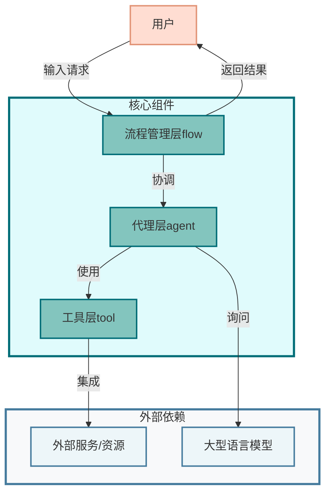
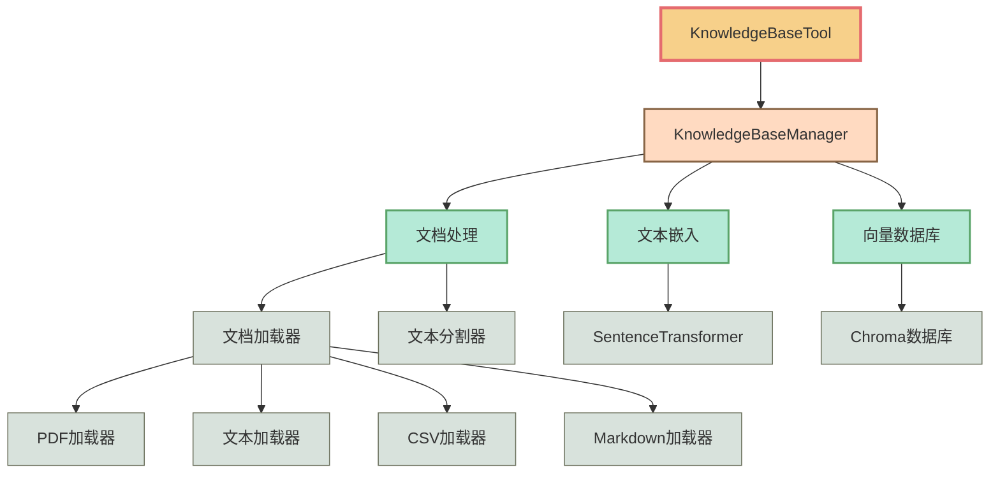

# OpenManus源码浅析与实践
- [OpenManus源码浅析与实践](#openmanus源码浅析与实践)
  - [概述](#概述)
    - [OpenManus架构层次](#openmanus架构层次)
  - [源码解析](#源码解析)
    - [核心数据结构](#核心数据结构)
      - [1. 消息系统 (app/schema.py)](#1-消息系统-appschemapy)
      - [2. 配置管理 (app/config.py)](#2-配置管理-appconfigpy)
    - [Agent基础架构](#agent基础架构)
      - [1. Agent基类 (app/agent/base.py)](#1-agent基类-appagentbasepy)
      - [2. ReAct模式实现 (app/agent/react.py)](#2-react模式实现-appagentreactpy)
      - [3. 工具调用Agent (app/agent/toolcall.py)](#3-工具调用agent-appagenttoolcallpy)
    - [核心功能实现](#核心功能实现)
      - [1. LLM集成与交互 (app/llm.py)](#1-llm集成与交互-appllmpy)
      - [2. Manus Agent实现 (app/agent/manus.py)](#2-manus-agent实现-appagentmanuspy)
      - [3. MCP Agent实现 (app/agent/mcp.py)](#3-mcp-agent实现-appagentmcppy)
    - [工具实现](#工具实现)
      - [1. 工具基础定义 (app/tool/__init__.py)](#1-工具基础定义-apptoolinitpy)
      - [2. 工具抽象基类 (app/tool/base.py)](#2-工具抽象基类-apptoolbasepy)
      - [3. 工具集合 (app/tool/tool\_collection.py)](#3-工具集合-apptooltool_collectionpy)
    - [流程管理](#流程管理)
      - [1. 流程基类 (app/flow/base.py)](#1-流程基类-appflowbasepy)
      - [2. 流程工厂 (app/flow/flow\_factory.py)](#2-流程工厂-appflowflow_factorypy)
      - [3. 计划流程 (app/flow/planning.py)](#3-计划流程-appflowplanningpy)
    - [总结](#总结)
      - [技术特点](#技术特点)
      - [设计模式应用](#设计模式应用)
  - [部署与使用](#部署与使用)
    - [直接使用](#直接使用)
    - [工作流模式](#工作流模式)
    - [配置项](#配置项)
  - [实践：RAG工具实现——KnowledgeBaseTool](#实践rag工具实现knowledgebasetool)
    - [实现原理](#实现原理)
      - [1. KnowledgeBaseManager](#1-knowledgebasemanager)
      - [2. 文档处理流程](#2-文档处理流程)
      - [3. 查询机制](#3-查询机制)
      - [4. 工具接口](#4-工具接口)
    - [技术特点](#技术特点-1)
    - [应用场景](#应用场景)
    - [与其他工具的协同](#与其他工具的协同)
    - [使用示例](#使用示例)

## 概述

OpenManus是一个由 MetaGPT 团队开发的开源项目，旨在实现商业 AI Agent 系统 Manus-

该框架采用了模块化设计，通过集成大语言模型(LLM)、功能丰富的工具集（包括浏览器操作工具、Python 执行工具、MCP 工具等）以及出色的流程管理系统，构建了一个完整的Agent系统。这一系统能够有效地解析用户需求、自主规划任务步骤、协调多代理协作，并通过工具调用执行复杂任务。

### OpenManus架构层次

1. **流程管理层 (Flow)**
   - 负责协调整体执行流程
   - 管理多代理之间的交互
   - 实现不同执行模式（如规划流、顺序流）

2. **代理层 (Agent)**
   - 封装智能体的核心行为
   - 与LLM交互获取决策
   - 管理代理的状态和记忆

3. **工具层 (Tool)**
   - 提供可被代理调用的各种工具
   - 定义统一的工具接口标准
   - 实现具体功能（如Python执行、浏览器操作、知识库查询）

4. **集成层**
   - 连接外部服务和资源
   - 包括LLM接入、文件系统访问等



OpenManus包含了多种优秀的软件工程和提示词工程实践。项目采用了一系列设计模式，为Agent的任务规划、异常处理、工具调用及结果处理提供了良好的基础。同时，OpenManus展现出良好的扩展性，本文后续将演示如何为其扩展 RAG (Retrieval-Augmented Generation) 工具，实现管理和查询本地知识库的能力。

接下来，本文将按照自底向上的顺序浅析项目源码：

1. **核心数据结构**
    - app/schema.py - 核心数据结构定义，包括消息类型、工具调用、内存管理等
    - app/config.py - 配置管理
2. **Agent基础架构**
    - app/agent/base.py - Agent基类，所有Agent的基础架构
    - app/agent/react.py - ReAct模式实现，思考-行动循环
    - app/agent/toolcall.py - 工具调用Agent实现，核心功能
3. **核心功能实现**
    - app/llm.py - LLM集成和交互实现
    - app/agent/manus.py - Manus Agent实现，主要入口点
    - app/agent/mcp.py - MCP Agent实现
4. **工具实现**
    - app/tool/__init__.py - 工具基础定义
    - app/tool/base.py - 工具抽象基类
    - app/tool/tool_collection.py - 工具集合
    - 其他具体工具类（python_execute.py, browser_use_tool.py, str_replace_editor.py等）
5. **流程管理**
    - app/flow/base.py - 流程基类
    - app/flow/flow_factory.py - 流程工厂
    - app/flow/planning.py - 计划流程实现
6. **入口文件**
    - main.py - 主入口
    - run_mcp.py - MCP模式入口
    - run_flow.py - Flow模式入口
7. **提示词模板**
    - app/prompt/ 目录下的各种提示词模板文件
8. **高级功能和扩展**
    - app/sandbox/ - 沙盒环境
    - app/mcp/ - MCP相关实现

## 源码解析

### 核心数据结构

#### 1. 消息系统 (app/schema.py)

OpenManus的消息系统采用了基于Pydantic的数据模型，定义了完整的对话交互结构：

1. **角色定义 (Role)**
   - 系统消息 (SYSTEM)：用于系统指令和初始化
   - 用户消息 (USER)：用户输入
   - 助手消息 (ASSISTANT)：AI代理的响应
   - 工具消息 (TOOL)：工具执行结果

2. **工具调用模型**
   - `Function`：定义工具函数调用的基本结构
     ```python
     class Function(BaseModel):
         name: str  # 函数名称
         arguments: str  # 函数参数（JSON字符串）
     ```
   - `ToolCall`：封装工具调用信息
     ```python
     class ToolCall(BaseModel):
         id: str  # 工具调用的唯一ID
         type: str = "function"  # 工具类型
         function: Function  # 函数信息
     ```

3. **消息模型 (Message)**
   - 核心字段：
     - `role`：消息角色
     - `content`：消息内容
     - `tool_calls`：工具调用列表
     - `name`：工具名称
     - `tool_call_id`：工具调用ID
     - `base64_image`：Base64编码的图像
   - 实用方法：
     - `to_dict()`：转换为字典格式
     - 工厂方法：`user_message()`, `system_message()`, `assistant_message()`, `tool_message()`
     - 运算符重载：支持消息列表的拼接操作

4. **内存管理 (Memory)**
   - 功能：
     - 消息历史存储
     - 消息数量限制
     - 消息添加和获取
   - 关键方法：
     - `add_message()`：添加单条消息
     - `add_messages()`：添加多条消息
     - `clear()`：清空消息
     - `get_recent_messages()`：获取最近消息
     - `to_dict_list()`：转换为字典列表

#### 2. 配置管理 (app/config.py)

配置系统采用单例模式实现，支持多环境配置管理：

1. **配置模型**
   - `LLMSettings`：语言模型配置
     - 模型名称、API地址、密钥
     - Token限制、温度参数
     - API类型和版本
   - `ProxySettings`：代理服务器配置
   - `SearchSettings`：搜索引擎配置
   - `BrowserSettings`：浏览器配置
   - `SandboxSettings`：沙箱环境配置
   - `MCPSettings`：MCP协议配置

2. **配置加载机制**
   - 配置文件格式：TOML
   - 优先级：`config.toml` > `config.example.toml`
   - 线程安全：使用锁机制确保线程安全
   - 延迟加载：首次访问时加载配置

3. **配置访问接口**
   ```python
   class Config:
       @property
       def llm(self) -> Dict[str, LLMSettings]
       @property
       def sandbox(self) -> SandboxSettings
       @property
       def browser_config(self) -> Optional[BrowserSettings]
       @property
       def search_config(self) -> Optional[SearchSettings]
       @property
       def mcp_config(self) -> MCPSettings
   ```

4. **工作空间管理**
   - 项目根目录：`PROJECT_ROOT`
   - 工作空间目录：`WORKSPACE_ROOT`
   - 路径解析：支持相对路径和绝对路径

### Agent基础架构

#### 1. Agent基类 (app/agent/base.py)

BaseAgent是所有Agent的抽象基类，提供了核心功能和状态管理：

1. **核心属性**
   ```python
   class BaseAgent(BaseModel, ABC):
       name: str  # Agent唯一标识
       description: Optional[str]  # 描述信息
       system_prompt: Optional[str]  # 系统提示词
       next_step_prompt: Optional[str]  # 下一步提示词
       llm: LLM  # 语言模型实例
       memory: Memory  # 内存管理
       state: AgentState  # 当前状态
       max_steps: int = 10  # 最大执行步数
       current_step: int = 0  # 当前步数
   ```

2. **状态管理**
   - 状态枚举：`IDLE`, `RUNNING`, `FINISHED`, `ERROR`
   - 状态转换：使用`state_context`上下文管理器确保状态转换安全
   - 状态检查：`is_stuck()`检测循环状态，这里通过检测重复内容来检查Agent是否陷入循环，检测到循环后，通过提示词来改变策略:

     `stuck_prompt:Observed duplicate responses. Consider new strategies and avoid repeating ineffective paths already attempted.`


3. **内存管理**
   - 消息添加：`update_memory()`支持多种消息类型
   - 消息访问：`messages`属性提供消息列表访问
   - 内存限制：支持最大消息数量限制

4. **执行控制**
   - 主循环：`run()`方法实现异步执行流程
   - 步骤执行：抽象方法`step()`由子类实现
   - 异常处理：循环检查及中断、超出最大步数中断

#### 2. ReAct模式实现 (app/agent/react.py)

ReActAgent定义了思考(Reasoning)-行动(Acting)循环模式：

1. **核心方法**
   ```python
   class ReActAgent(BaseAgent, ABC):
       @abstractmethod
       async def think(self) -> bool:
           """处理当前状态并决定下一步行动"""

       @abstractmethod
       async def act(self) -> str:
           """执行已决定的行动"""

       async def step(self) -> str:
           """执行单个步骤：思考和行动"""
   ```

2. **执行流程**
   - 思考阶段：分析当前状态，决定是否需要行动
   - 行动阶段：执行已决定的行动
   - 结果处理：返回执行结果

#### 3. 工具调用Agent (app/agent/toolcall.py)

ToolCallAgent实现了工具调用和管理的核心功能，继承自ReActAgent，是系统中负责工具调用和管理的核心组件。它通过思考-行动循环模式，实现了智能的工具选择和执行流程。

1. **核心属性**
   ```python
   class ToolCallAgent(ReActAgent):
       name: str = "toolcall"  # Agent名称
       description: str = "an agent that can execute tool calls."  # Agent描述
       system_prompt: str = SYSTEM_PROMPT  # 系统提示
       next_step_prompt: str = NEXT_STEP_PROMPT  # 下一步提示
       available_tools: ToolCollection = ToolCollection(CreateChatCompletion(), Terminate())  # 可用工具集合
       tool_choices: TOOL_CHOICE_TYPE = ToolChoice.AUTO  # 工具选择模式
       special_tool_names: List[str] = Field(default_factory=lambda: [Terminate().name])  # 特殊工具列表
       tool_calls: List[ToolCall] = Field(default_factory=list)  # 工具调用列表
       _current_base64_image: Optional[str] = None  # 当前base64编码图像
       max_steps: int = 30  # 最大步骤数
       max_observe: Optional[Union[int, bool]] = None  # 最大观察长度限制
   ```
   - 基础配置：定义了Agent的名称、描述和提示词模板
   - 工具管理：通过`ToolCollection`管理可用工具，默认包含对话创建和终止工具
   - 工具选择：支持`AUTO`、`NONE`、`REQUIRED`三种模式
   - 特殊工具：维护需要特殊处理的工具列表，如终止工具
   - 状态管理：记录工具调用列表和当前图像数据
   - 执行控制：通过`max_steps`和`max_observe`限制执行步数和观察长度

2. **思考过程**
   ```python
   async def think(self) -> bool:
       """处理当前状态并使用工具决定下一步操作"""
       # 1. 添加下一步提示
       if self.next_step_prompt:
           user_msg = Message.user_message(self.next_step_prompt)
           self.messages += [user_msg]

       # 2. 获取LLM响应
       try:
           response = await self.llm.ask_tool(
               messages=self.messages,
               system_msgs=[Message.system_message(self.system_prompt)] if self.system_prompt else None,
               tools=self.available_tools.to_params(),
               tool_choice=self.tool_choices,
           )
       except Exception as e:
           # 处理Token限制错误
           if hasattr(e, "__cause__") and isinstance(e.__cause__, TokenLimitExceeded):
               self.memory.add_message(Message.assistant_message(f"Maximum token limit reached: {str(e.__cause__)}"))
               self.state = AgentState.FINISHED
               return False
           raise

       # 3. 解析响应
       self.tool_calls = response.tool_calls if response and response.tool_calls else []
       content = response.content if response and response.content else ""

       # 4. 处理不同工具选择模式
       if self.tool_choices == ToolChoice.NONE:
           if tool_calls:
               logger.warning(f"Agent tried to use tools when they weren't available!")
           if content:
               self.memory.add_message(Message.assistant_message(content))
               return True
           return False

       # 5. 添加助手消息
       assistant_msg = Message.from_tool_calls(content=content, tool_calls=self.tool_calls) if self.tool_calls else Message.assistant_message(content)
       self.memory.add_message(assistant_msg)

       # 6. 决定是否继续执行
       if self.tool_choices == ToolChoice.REQUIRED and not self.tool_calls:
           return True
       if self.tool_choices == ToolChoice.AUTO and not self.tool_calls:
           return bool(content)
       return bool(self.tool_calls)
   ```
   - 提示词处理：支持系统提示和下一步提示的组合
   - LLM交互：通过`ask_tool`方法获取工具调用决策
   - 错误处理：特别处理Token限制错误
   - 模式处理：根据不同的工具选择模式决定执行流程
   - 消息管理：维护对话历史和工具调用记录

3. **行动执行**
   ```python
   async def act(self) -> str:
       """执行工具调用并处理结果"""
       # 1. 检查工具调用需求
       if not self.tool_calls:
           if self.tool_choices == ToolChoice.REQUIRED:
               raise ValueError(TOOL_CALL_REQUIRED)
           return self.messages[-1].content or "No content or commands to execute"

       # 2. 执行工具调用
       results = []
       for command in self.tool_calls:
           self._current_base64_image = None
           result = await self.execute_tool(command)

           # 3. 处理观察长度限制
           if self.max_observe:
               result = result[:self.max_observe]

           # 4. 添加工具消息
           tool_msg = Message.tool_message(
               content=result,
               tool_call_id=command.id,
               name=command.function.name,
               base64_image=self._current_base64_image,
           )
           self.memory.add_message(tool_msg)
           results.append(result)

       return "\n\n".join(results)
   ```
   - 工具调用验证：检查是否满足工具调用需求
   - 工具执行：遍历执行所有工具调用
   - 结果处理：支持图像数据和观察长度限制
   - 消息管理：维护工具执行结果

4. **工具执行**
   ```python
   async def execute_tool(self, command: ToolCall) -> str:
       """执行单个工具调用，具有健壮的错误处理功能"""
       # 1. 验证命令格式
       if not command or not command.function or not command.function.name:
           return "Error: Invalid command format"

       name = command.function.name
       if name not in self.available_tools.tool_map:
           return f"Error: Unknown tool '{name}'"

       try:
           # 2. 解析和执行
           args = json.loads(command.function.arguments or "{}")
           result = await self.available_tools.execute(name=name, tool_input=args)

           # 3. 处理特殊工具
           await self._handle_special_tool(name=name, result=result)

           # 4. 处理图像数据
           if hasattr(result, "base64_image") and result.base64_image:
               self._current_base64_image = result.base64_image

           # 5. 格式化结果
           observation = (
               f"Observed output of cmd `{name}` executed:\n{str(result)}"
               if result
               else f"Cmd `{name}` completed with no output"
           )
           return observation

       except json.JSONDecodeError:
           return f"Error parsing arguments for {name}: Invalid JSON format"
       except Exception as e:
           return f"Error: Tool '{name}' encountered a problem: {str(e)}"
   ```
   - 命令验证：检查工具调用格式和工具存在性
   - 参数解析：处理JSON格式的工具参数
   - 特殊工具：处理需要特殊逻辑的工具
   - 图像处理：支持工具返回的图像数据
   - 错误处理：捕获并处理各种可能的错误

5. **特殊工具处理**
   ```python
   async def _handle_special_tool(self, name: str, result: Any, **kwargs):
       """处理特殊工具执行和状态变化"""
       if not self._is_special_tool(name):
           return

       if self._should_finish_execution(name=name, result=result, **kwargs):
           logger.info(f"Special tool '{name}' has completed the task!")
           self.state = AgentState.FINISHED
   ```
   - 工具识别：通过名称检查是否为特殊工具
   - 状态管理：根据工具执行结果更新Agent状态
   - 日志记录：记录特殊工具的执行情况

6. **资源清理**
   ```python
   async def cleanup(self):
       """清理agent的工具使用的资源"""
       for tool_name, tool_instance in self.available_tools.tool_map.items():
           if hasattr(tool_instance, "cleanup") and asyncio.iscoroutinefunction(tool_instance.cleanup):
               try:
                   await tool_instance.cleanup()
               except Exception as e:
                   logger.error(f"Error cleaning up tool '{tool_name}': {e}", exc_info=True)
   ```
   - 工具清理：遍历清理所有工具的资源
   - 异步支持：处理异步清理方法
   - 错误处理：捕获并记录清理过程中的错误

### 核心功能实现

#### 1. LLM集成与交互 (app/llm.py)

LLM类实现了与各种语言模型的交互接口，支持OpenAI、Azure和AWS Bedrock等多种后端：

1. **Token管理**
   ```python
   class TokenCounter:
       # Token常量
       BASE_MESSAGE_TOKENS = 4  # 每条消息的基础token数
       FORMAT_TOKENS = 2  # 消息格式的token数
       LOW_DETAIL_IMAGE_TOKENS = 85  # 低详细度图像的token数
       HIGH_DETAIL_TILE_TOKENS = 170  # 高详细度图像块的token数

       # 图像处理常量
       MAX_SIZE = 2048  # 图像的最大尺寸
       HIGH_DETAIL_TARGET_SHORT_SIDE = 768  # 高详细度模式下短边的目标尺寸
       TILE_SIZE = 512  # 图像分块的大小
   ```
   - 文本计数：`count_text()`计算文本字符串的token数量
   - 图像计数：`count_image()`基于详细度级别和尺寸计算图像的token数量
   - 内容计数：`count_content()`处理混合文本和图像的内容
   - 工具调用计数：`count_tool_calls()`计算工具调用的token数量
   - 消息计数：`count_message_tokens()`计算整个消息列表的token数量

2. **LLM客户端**
   ```python
   class LLM:
       _instances: Dict[str, "LLM"] = {}  # 单例模式存储实例

       def __new__(cls, config_name: str = "default", llm_config: Optional[LLMSettings] = None):
           """实现单例模式"""
           if config_name not in cls._instances:
               instance = super().__new__(cls)
               instance.__init__(config_name, llm_config)
               cls._instances[config_name] = instance
           return cls._instances[config_name]

       def __init__(self, config_name: str = "default", llm_config: Optional[LLMSettings] = None):
           """初始化LLM客户端"""
           if not hasattr(self, "client"):
               # 配置加载
               llm_config = llm_config or config.llm
               llm_config = llm_config.get(config_name, llm_config["default"])

               # 基础配置
               self.model = llm_config.model
               self.max_tokens = llm_config.max_tokens
               self.temperature = llm_config.temperature

               # API配置
               self.api_type = llm_config.api_type
               self.api_key = llm_config.api_key
               self.api_version = llm_config.api_version
               self.base_url = llm_config.base_url

               # Token统计
               self.total_input_tokens = 0
               self.total_completion_tokens = 0
               self.max_input_tokens = llm_config.max_input_tokens if hasattr(llm_config, "max_input_tokens") else None

               # Tokenizer初始化
               try:
                   self.tokenizer = tiktoken.encoding_for_model(self.model)
               except KeyError:
                   self.tokenizer = tiktoken.get_encoding("cl100k_base")

               # 客户端初始化
               if self.api_type == "azure":
                   self.client = AsyncAzureOpenAI(
                       base_url=self.base_url,
                       api_key=self.api_key,
                       api_version=self.api_version,
                   )
               elif self.api_type == "aws":
                   self.client = BedrockClient()
               else:
                   self.client = AsyncOpenAI(api_key=self.api_key, base_url=self.base_url)
   ```
   - 单例模式：确保每个配置只创建一个实例
   - 配置管理：支持多环境配置和默认配置
   - 多后端支持：适配OpenAI、Azure和AWS Bedrock
   - Token管理：跟踪输入和输出的token数量

3. **核心方法**
   ```python
   @retry(
       wait=wait_random_exponential(min=1, max=60),
       stop=stop_after_attempt(6),
       retry=retry_if_exception_type((OpenAIError, Exception, ValueError)),
   )
   async def ask(
       self,
       messages: List[Union[dict, Message]],
       system_msgs: Optional[List[Union[dict, Message]]] = None,
       stream: bool = True,
       temperature: Optional[float] = None,
   ) -> str:
       """基础对话接口"""
       # 1. 格式化消息
       formatted_messages = self.format_messages(messages, supports_images=False)
       if system_msgs:
           formatted_messages = self.format_messages(system_msgs) + formatted_messages

       # 2. 检查token限制
       input_tokens = self.count_message_tokens(formatted_messages)
       if self.check_token_limit(input_tokens):
           raise TokenLimitExceeded(self.get_limit_error_message(input_tokens))

       # 3. 调用API
       response = await self.client.chat.completions.create(
           model=self.model,
           messages=formatted_messages,
           stream=stream,
           temperature=temperature or self.temperature,
           max_tokens=self.max_tokens,
       )

       # 4. 处理响应
       if stream:
           return await self._handle_stream_response(response)
       return response.choices[0].message.content
   ```
   - 消息格式化：支持多种消息格式和系统消息
   - Token检查：防止超出模型限制
   - 流式响应：支持流式传输和普通响应
   - 错误重试：使用指数退避策略处理临时错误，发起重试

4. **图像支持**
   ```python
   @retry(
       wait=wait_random_exponential(min=1, max=60),
       stop=stop_after_attempt(6),
       retry=retry_if_exception_type((OpenAIError, Exception, ValueError)),
   )
   async def ask_with_images(
       self,
       messages: List[Union[dict, Message]],
       images: List[Union[str, dict]],
       system_msgs: Optional[List[Union[dict, Message]]] = None,
       stream: bool = False,
       temperature: Optional[float] = None,
   ) -> str:
       """支持图像的对话接口"""
       # 1. 检查模型支持
       if self.model not in MULTIMODAL_MODELS:
           raise ValueError(f"Model {self.model} does not support images")

       # 2. 格式化消息和图像
       formatted_messages = self.format_messages(messages, supports_images=True)
       if system_msgs:
           formatted_messages = self.format_messages(system_msgs) + formatted_messages

       # 3. 处理图像
       for image in images:
           if isinstance(image, str):
               image = {"url": image}
           formatted_messages.append({"role": "user", "content": [{"type": "image_url", "image_url": image}]})

       # 4. 调用API
       response = await self.client.chat.completions.create(
           model=self.model,
           messages=formatted_messages,
           stream=stream,
           temperature=temperature or self.temperature,
           max_tokens=self.max_tokens,
       )

       return response.choices[0].message.content
   ```
   - 模型检查：验证模型是否支持图像处理
   - 图像格式化：支持URL和图像数据字典
   - 消息组合：将图像与文本消息组合
   - 错误处理：处理图像处理相关的错误

5. **工具调用**
   ```python
   @retry(
       wait=wait_random_exponential(min=1, max=60),
       stop=stop_after_attempt(6),
       retry=retry_if_exception_type((OpenAIError, Exception, ValueError)),
   )
   async def ask_tool(
       self,
       messages: List[Union[dict, Message]],
       system_msgs: Optional[List[Union[dict, Message]]] = None,
       timeout: int = 300,
       tools: Optional[List[dict]] = None,
       tool_choice: TOOL_CHOICE_TYPE = ToolChoice.AUTO,
       temperature: Optional[float] = None,
       **kwargs,
   ) -> ChatCompletionMessage | None:
       """工具调用接口"""
       # 1. 格式化消息
       formatted_messages = self.format_messages(messages)
       if system_msgs:
           formatted_messages = self.format_messages(system_msgs) + formatted_messages

       # 2. 检查token限制
       input_tokens = self.count_message_tokens(formatted_messages)
       if self.check_token_limit(input_tokens):
           raise TokenLimitExceeded(self.get_limit_error_message(input_tokens))

       # 3. 调用API
       response = await self.client.chat.completions.create(
           model=self.model,
           messages=formatted_messages,
           tools=tools,
           tool_choice=tool_choice,
           temperature=temperature or self.temperature,
           max_tokens=self.max_tokens,
           timeout=timeout,
           **kwargs,
       )

       return response.choices[0].message
   ```
   - 工具参数：支持工具定义和选择策略
   - 超时控制：设置请求超时时间
   - 灵活配置：支持额外的完成参数
   - 错误处理：处理工具调用相关的错误

#### 2. Manus Agent实现 (app/agent/manus.py)

Manus是系统的核心Agent，继承自ToolCallAgent，集成了多种工具并实现了浏览器上下文管理：

1. **基础属性**
   ```python
   class Manus(ToolCallAgent):
       name: str = "Manus"  # 代理名称
       description: str = "A versatile agent that can solve various tasks using multiple tools"  # 代理描述
       system_prompt: str = SYSTEM_PROMPT.format(directory=config.workspace_root)  # 系统提示词
       next_step_prompt: str = NEXT_STEP_PROMPT  # 下一步提示词
       max_observe: int = 10000  # 最大观察次数
       max_steps: int = 20  # 最大执行步骤
   ```
   - 名称和描述：定义了Agent的基本标识和功能说明
   - 提示词配置：使用工作空间根目录格式化系统提示词
   - 执行限制：通过`max_observe`和`max_steps`控制执行过程

2. **工具集成**
   ```python
   available_tools: ToolCollection = Field(
       default_factory=lambda: ToolCollection(
           PythonExecute(),  # Python执行工具
           BrowserUseTool(),  # 浏览器使用工具
           StrReplaceEditor(),  # 字符串替换编辑器工具
           KnowledgeBaseTool(),  # 知识库工具
           Terminate()  # 终止工具
       )
   )
   special_tool_names: list[str] = Field(default_factory=lambda: [Terminate().name])
   ```
   - 工具集合：通过`ToolCollection`管理多个功能工具
   - 特殊工具：维护需要特殊处理的工具列表
   - 默认工具：包含Python执行、浏览器操作、文本编辑等核心功能

3. **浏览器上下文管理**
   ```python
   browser_context_helper: Optional[BrowserContextHelper] = None

   @model_validator(mode="after")
   def initialize_helper(self) -> "Manus":
       """初始化浏览器上下文助手"""
       self.browser_context_helper = BrowserContextHelper(self)
       return self
   ```
   - 上下文助手：通过`BrowserContextHelper`管理浏览器状态
   - 自动初始化：使用Pydantic验证器确保助手实例化
   - 状态管理：维护浏览器会话和资源

4. **思考过程增强**
   ```python
   async def think(self) -> bool:
       """处理当前状态并决定下一步行动"""
       original_prompt = self.next_step_prompt
       recent_messages = self.memory.messages[-3:] if self.memory.messages else []

       # 检查浏览器使用状态
       browser_in_use = any(
           tc.function.name == BrowserUseTool().name
           for msg in recent_messages
           if msg.tool_calls
           for tc in msg.tool_calls
       )

       if browser_in_use:
           self.next_step_prompt = await self.browser_context_helper.format_next_step_prompt()

       result = await super().think()

       self.next_step_prompt = original_prompt
       return result
   ```
   - 上下文感知：检查最近消息中的浏览器使用情况
   - 动态提示词：根据浏览器状态调整提示词
   - 状态恢复：确保提示词在思考后恢复原状
   - 继承扩展：在父类基础上增强思考逻辑

5. **资源清理**
   ```python
   async def cleanup(self):
       """清理Manus代理的资源"""
       if self.browser_context_helper:
           await self.browser_context_helper.cleanup_browser()
   ```
   - 浏览器清理：确保浏览器资源正确释放
   - 条件检查：只在存在浏览器上下文时执行清理
   - 异步支持：使用异步方法处理清理操作

6. **设计特点**
   - 模块化设计：通过工具集合实现功能扩展
   - 上下文感知：根据使用场景动态调整行为
   - 资源管理：确保资源的正确初始化和清理
   - 继承复用：在ToolCallAgent基础上扩展功能

#### 3. MCP Agent实现 (app/agent/mcp.py)

MCP Agent实现了与外部服务的协议交互，支持SSE和stdio两种连接方式：

1. **基础属性**
   ```python
   class MCPAgent(ToolCallAgent):
       name: str = "mcp_agent"  # 代理名称
       description: str = "An agent that connects to an MCP server and uses its tools."  # 代理描述
       system_prompt: str = SYSTEM_PROMPT  # 系统提示词
       next_step_prompt: str = NEXT_STEP_PROMPT  # 下一步提示词
       mcp_clients: MCPClients = Field(default_factory=MCPClients)  # MCP客户端实例
       available_tools: MCPClients = None  # 可用工具集合
       max_steps: int = 20  # 最大执行步骤
       connection_type: str = "stdio"  # 连接类型
       tool_schemas: Dict[str, Dict[str, Any]] = Field(default_factory=dict)  # 工具模式字典
       _refresh_tools_interval: int = 5  # 工具刷新间隔
       special_tool_names: List[str] = Field(default_factory=lambda: ["terminate"])  # 特殊工具列表
   ```
   - 基本配置：定义了Agent的名称、描述和提示词
   - 连接管理：支持SSE和stdio两种连接方式
   - 工具管理：维护工具模式和刷新机制
   - 执行控制：通过`max_steps`限制执行步数

2. **初始化机制**
   ```python
   async def initialize(
       self,
       connection_type: Optional[str] = None,
       server_url: Optional[str] = None,
       command: Optional[str] = None,
       args: Optional[List[str]] = None,
   ) -> None:
       """Initialize the MCP connection"""
       if connection_type:
           self.connection_type = connection_type

       # 建立连接
       if self.connection_type == "sse":
           if not server_url:
               raise ValueError("Server URL is required for SSE connection")
           await self.mcp_clients.connect_sse(server_url=server_url)
       elif self.connection_type == "stdio":
           if not command:
               raise ValueError("Command is required for stdio connection")
           await self.mcp_clients.connect_stdio(command=command, args=args or [])
       else:
           raise ValueError(f"Unsupported connection type: {self.connection_type}")

       # 初始化工具
       self.available_tools = self.mcp_clients
       await self._refresh_tools()

       # 添加系统消息
       tool_names = list(self.mcp_clients.tool_map.keys())
       tools_info = ", ".join(tool_names)
       self.memory.add_message(
           Message.system_message(
               f"{self.system_prompt}\n\nAvailable MCP tools: {tools_info}"
           )
       )
   ```
   - 连接建立：支持SSE和stdio两种方式
   - 参数验证：检查必要的连接参数
   - 工具初始化：刷新和加载可用工具
   - 系统消息：添加工具信息到系统提示

3. **工具管理**
   ```python
   async def _refresh_tools(self) -> Tuple[List[str], List[str]]:
       """Refresh the list of available tools"""
       if not self.mcp_clients.session:
           return [], []

       # 获取当前工具
       response = await self.mcp_clients.session.list_tools()
       current_tools = {tool.name: tool.inputSchema for tool in response.tools}

       # 检测变化
       current_names = set(current_tools.keys())
       previous_names = set(self.tool_schemas.keys())
       added_tools = list(current_names - previous_names)
       removed_tools = list(previous_names - current_names)
       changed_tools = [
           name for name in current_names.intersection(previous_names)
           if current_tools[name] != self.tool_schemas.get(name)
       ]

       # 更新状态
       self.tool_schemas = current_tools

       # 记录变化
       if added_tools:
           logger.info(f"Added MCP tools: {added_tools}")
           self.memory.add_message(
               Message.system_message(f"New tools available: {', '.join(added_tools)}")
           )
       if removed_tools:
           logger.info(f"Removed MCP tools: {removed_tools}")
           self.memory.add_message(
               Message.system_message(f"Tools no longer available: {', '.join(removed_tools)}")
           )

       return added_tools, removed_tools
   ```
   - 工具检测：定期检查工具变化
   - 变化追踪：记录新增、移除和修改的工具
   - 状态更新：维护工具模式字典
   - 消息通知：通过系统消息通知工具变化

4. **思考过程**
   ```python
   async def think(self) -> bool:
       """Process current state and decide next action"""
       # 检查服务可用性
       if not self.mcp_clients.session or not self.mcp_clients.tool_map:
           logger.info("MCP service is no longer available, ending interaction")
           self.state = AgentState.FINISHED
           return False

       # 定期刷新工具
       if self.current_step % self._refresh_tools_interval == 0:
           await self._refresh_tools()
           if not self.mcp_clients.tool_map:
               logger.info("MCP service has shut down, ending interaction")
               self.state = AgentState.FINISHED
               return False

       return await super().think()
   ```
   - 服务检查：验证MCP服务可用性
   - 工具刷新：定期更新工具列表
   - 状态管理：处理服务不可用情况
   - 继承扩展：复用父类思考逻辑

5. **特殊工具处理**
   ```python
   async def _handle_special_tool(self, name: str, result: Any, **kwargs) -> None:
       """Handle special tool execution and state changes"""
       await super()._handle_special_tool(name, result, **kwargs)

       # 处理多媒体响应
       if isinstance(result, ToolResult) and result.base64_image:
           self.memory.add_message(
               Message.system_message(
                   MULTIMEDIA_RESPONSE_PROMPT.format(tool_name=name)
               )
           )

   def _should_finish_execution(self, name: str, **kwargs) -> bool:
       """Determine if tool execution should finish the agent"""
       return name.lower() == "terminate"
   ```
   - 多媒体支持：处理包含图像的响应
   - 终止控制：通过特殊工具控制执行流程
   - 消息管理：添加多媒体响应提示

6. **资源管理**
   ```python
   async def cleanup(self) -> None:
       """Clean up MCP connection when done"""
       if self.mcp_clients.session:
           await self.mcp_clients.disconnect()
           logger.info("MCP connection closed")

   async def run(self, request: Optional[str] = None) -> str:
       """Run the agent with cleanup when done"""
       try:
           result = await super().run(request)
           return result
       finally:
           await self.cleanup()
   ```
   - 连接清理：确保正确断开MCP连接
   - 错误处理：使用try-finally保证清理执行
   - 日志记录：记录连接状态变化

7. **设计特点**
   - 协议支持：实现MCP协议交互
   - 动态工具：支持工具的动态发现和更新
   - 连接管理：提供多种连接方式
   - 资源安全：确保资源的正确释放
   - 状态监控：实时监控服务可用性

### 工具实现

#### 1. 工具基础定义 (app/tool/__init__.py)

工具系统采用模块化设计，包含多种功能工具：

1. **核心工具**
   - `BaseTool`：工具抽象基类
   - `Bash`：命令行工具
   - `BrowserUseTool`：浏览器操作工具
   - `CreateChatCompletion`：对话创建工具
   - `DeepResearch`：深度研究工具
   - `PlanningTool`：规划工具
   - `StrReplaceEditor`：文本编辑工具
   - `Terminate`：终止工具
   - `WebSearch`：网络搜索工具

2. **工具集合**
   - `ToolCollection`：工具集合管理类

#### 2. 工具抽象基类 (app/tool/base.py)

BaseTool定义了所有工具的统一接口：

1. **基础属性**
   ```python
   class BaseTool(ABC, BaseModel):
       name: str  # 工具名称
       description: str  # 工具描述
       parameters: Optional[dict]  # 工具参数
   ```

2. **核心方法**
   - `__call__()`：使工具实例可调用
   - `execute()`：抽象执行方法
   - `to_param()`：转换为函数调用格式

3. **结果处理**
   ```python
   class ToolResult(BaseModel):
       output: Any  # 输出结果
       error: Optional[str]  # 错误信息
       base64_image: Optional[str]  # 图像数据
       system: Optional[str]  # 系统信息
   ```
   - 结果合并：`__add__()`
   - 字段替换：`replace()`
   - 字符串表示：`__str__()`

4. **特殊结果类型**
   - `CLIResult`：命令行输出结果
   - `ToolFailure`：工具执行失败结果

#### 3. 工具集合 (app/tool/tool_collection.py)

ToolCollection实现了工具的管理和调用：

1. **工具管理**
   ```python
   class ToolCollection:
       def __init__(self, *tools: BaseTool):
           self.tools = tools
           self.tool_map = {tool.name: tool for tool in tools}
   ```
   - 工具添加：`add_tool()`, `add_tools()`
   - 工具获取：`get_tool()`
   - 工具遍历：`__iter__()`

2. **工具执行**
   - 单个执行：`execute()`
   - 批量执行：`execute_all()`
   - 参数转换：`to_params()`

3. **错误处理**
   - 工具不存在处理
   - 执行异常捕获
   - 失败结果封装

### 流程管理

#### 1. 流程基类 (app/flow/base.py)

BaseFlow定义了流程管理的基础框架，支持多代理协作：

1. **基础属性**
   ```python
   class BaseFlow(BaseModel, ABC):
       agents: Dict[str, BaseAgent]  # 代理字典
       tools: Optional[List] = None  # 工具列表
       primary_agent_key: Optional[str] = None  # 主代理键
   ```
   - 代理管理：通过字典存储多个代理实例
   - 工具支持：可选的工具列表
   - 主代理：标识流程中的主要执行者

2. **初始化机制**
   ```python
   def __init__(
       self, agents: Union[BaseAgent, List[BaseAgent], Dict[str, BaseAgent]], **data
   ):
       # 处理不同方式提供的代理
       if isinstance(agents, BaseAgent):
           agents_dict = {"default": agents}
       elif isinstance(agents, list):
           agents_dict = {f"agent_{i}": agent for i, agent in enumerate(agents)}
       else:
           agents_dict = agents

       # 设置主代理
       primary_key = data.get("primary_agent_key")
       if not primary_key and agents_dict:
           primary_key = next(iter(agents_dict))
           data["primary_agent_key"] = primary_key

       data["agents"] = agents_dict
       super().__init__(**data)
   ```
   - 灵活输入：支持多种代理输入格式
   - 自动主代理：未指定时使用第一个代理
   - 数据验证：使用Pydantic确保数据正确性

3. **代理访问**
   ```python
   @property
   def primary_agent(self) -> Optional[BaseAgent]:
       """Get the primary agent for the flow"""
       return self.agents.get(self.primary_agent_key)

   def get_agent(self, key: str) -> Optional[BaseAgent]:
       """Get a specific agent by key"""
       return self.agents.get(key)

   def add_agent(self, key: str, agent: BaseAgent) -> None:
       """Add a new agent to the flow"""
       self.agents[key] = agent
   ```
   - 主代理访问：通过属性获取主代理
   - 代理查找：根据键名获取特定代理
   - 代理添加：支持动态添加新代理

4. **执行接口**
   ```python
   @abstractmethod
   async def execute(self, input_text: str) -> str:
       """Execute the flow with given input"""
   ```
   - 抽象方法：子类必须实现执行逻辑
   - 异步支持：使用async/await处理异步操作
   - 输入输出：支持文本输入和输出

#### 2. 流程工厂 (app/flow/flow_factory.py)

FlowFactory实现了流程创建的工厂模式：

1. **流程类型**
   ```python
   class FlowType(str, Enum):
       PLANNING = "planning"  # 计划流程
   ```
   - 枚举定义：使用str枚举便于序列化
   - 类型扩展：预留其他流程类型支持

2. **工厂方法**
   ```python
   @staticmethod
   def create_flow(
       flow_type: FlowType,
       agents: Union[BaseAgent, List[BaseAgent], Dict[str, BaseAgent]],
       **kwargs
   ) -> BaseFlow:
       flows = {
           FlowType.PLANNING: PlanningFlow,
       }

       flow_class = flows.get(flow_type)
       if not flow_class:
           raise ValueError(f"Unknown flow type: {flow_type}")

       return flow_class(agents, **kwargs)
   ```
   - 类型映射：将流程类型映射到实现类
   - 参数传递：支持额外配置参数
   - 错误处理：检查无效流程类型

3. **流程工厂优点**

- 解耦与抽象

    流程工厂将流程的创建逻辑与具体实现分离
客户端代码不需要知道具体的流程实现类
只需要指定流程类型(FlowType)即可获取对应的流程实例

- 扩展性
    - 当需要添加新的流程类型时，只需在工厂中注册新的映射
    - 不需要修改使用流程的客户端代码
    - 符合开闭原则(OCP)

- 统一接口
    - 所有流程都通过相同的工厂方法创建
    - 确保流程实例化的一致性
    - 便于统一管理流程的生命周期
    - 提供统一的参数验证和错误处理机制

- 依赖注入
    - 工厂可以处理复杂的依赖关系
    - 可以注入必要的工具和配置
    - 简化流程实例的初始化过程


#### 3. 计划流程 (app/flow/planning.py)

PlanningFlow实现了基于计划的执行流程：

1. **步骤状态定义**
   ```python
   class PlanStepStatus(str, Enum):
       NOT_STARTED = "not_started"  # 未开始
       IN_PROGRESS = "in_progress"  # 进行中
       COMPLETED = "completed"  # 已完成
       BLOCKED = "blocked"  # 被阻塞

       @classmethod
       def get_all_statuses(cls) -> list[str]:
           return [status.value for status in cls]

       @classmethod
       def get_active_statuses(cls) -> list[str]:
           return [cls.NOT_STARTED.value, cls.IN_PROGRESS.value]

       @classmethod
       def get_status_marks(cls) -> Dict[str, str]:
           return {
               cls.COMPLETED.value: "[✓]",
               cls.IN_PROGRESS.value: "[→]",
               cls.BLOCKED.value: "[!]",
               cls.NOT_STARTED.value: "[ ]",
           }
   ```
   - 状态定义：包括`未开始`、`进行中`、`已完成`、`阻塞`
   - 状态查询：提供状态列表和标记
   - 状态转换：支持状态间的转换

2. **PlanningFlow核心属性**
   ```python
   class PlanningFlow(BaseFlow):
       llm: LLM = Field(default_factory=lambda: LLM())
       planning_tool: PlanningTool = Field(default_factory=PlanningTool)
       executor_keys: List[str] = Field(default_factory=list)
       active_plan_id: str = Field(default_factory=lambda: f"plan_{int(time.time())}")
       current_step_index: Optional[int] = None
   ```
   - LLM集成：用于生成和总结计划
   - 计划工具：管理计划创建和执行
   - 执行器管理：维护可用的执行代理
   - 计划跟踪：记录当前活动计划

3. **流程执行（计划→执行→结果记录）**
   ```python
   async def execute(self, input_text: str) -> str:
       try:
           if not self.primary_agent:
               raise ValueError("No primary agent available")

           if input_text:
               await self._create_initial_plan(input_text)

           result = ""
           while True:
               self.current_step_index, step_info = await self._get_current_step_info()
               if self.current_step_index is None:
                   result += await self._finalize_plan()
                   break

               step_type = step_info.get("type") if step_info else None
               executor = self.get_executor(step_type)
               step_result = await self._execute_step(executor, step_info)
               result += step_result + "\n"

               if hasattr(executor, "state") and executor.state == AgentState.FINISHED:
                   break

           return result
       except Exception as e:
           logger.error(f"Error in PlanningFlow: {str(e)}")
           return f"Execution failed: {str(e)}"
   ```
   - 计划创建：根据输入生成初始计划
   - 步骤执行：循环执行计划步骤
   - 执行器选择：根据步骤类型选择代理
   - 错误处理：捕获并记录执行错误

4. **计划创建**
   ```python
   async def _create_initial_plan(self, request: str) -> None:
       system_message = Message.system_message(
           "You are a planning assistant. Create a concise, actionable plan with clear steps. "
           "Focus on key milestones rather than detailed sub-steps. "
           "Optimize for clarity and efficiency."
       )

       user_message = Message.user_message(
           f"Create a reasonable plan with clear steps to accomplish the task: {request}"
       )

       response = await self.llm.ask_tool(
           messages=[user_message],
           system_msgs=[system_message],
           tools=[self.planning_tool.to_param()],
           tool_choice=ToolChoice.AUTO,
       )
   ```
   - 提示词设计：引导LLM生成有效计划
   - 工具调用：使用PlanningTool创建计划
   - 参数处理：解析和验证工具参数

5. **步骤管理**
   ```python
   async def _get_current_step_info(self) -> tuple[Optional[int], Optional[dict]]:
       if not self.active_plan_id or self.active_plan_id not in self.planning_tool.plans:
           return None, None

       plan_data = self.planning_tool.plans[self.active_plan_id]
       steps = plan_data.get("steps", [])
       step_statuses = plan_data.get("step_statuses", [])

       for i, step in enumerate(steps):
           if i >= len(step_statuses):
               status = PlanStepStatus.NOT_STARTED.value
           else:
               status = step_statuses[i]

           if status in PlanStepStatus.get_active_statuses():
               step_info = {"text": step}
               type_match = re.search(r"\[([A-Z_]+)\]", step)
               if type_match:
                   step_info["type"] = type_match.group(1).lower()
               return i, step_info

       return None, None
   ```
   - 状态检查：验证计划存在性
   - 步骤遍历：查找下一个待执行步骤
   - 类型提取：从步骤文本中提取类型信息
   - 状态管理：维护步骤执行状态

6. **设计特点**
   - 模块化：通过基类和工厂模式实现扩展
   - 状态管理：完善的步骤状态跟踪
   - 错误处理：健壮的错误捕获和恢复
   - 灵活性：支持多种代理和工具组合
   - 可扩展：预留其他流程类型支持

### 总结

本节分析了OpenManus项目的核心代码实现，主要包含以下几个关键部分：
1. **核心数据结构**
- **消息系统**：基于Pydantic实现了完整的对话交互结构，包括角色定义、工具调用模型和消息模型
- **配置管理**：支持环境变量、配置文件和工作空间管理，提供灵活的配置机制
2. **Agent基础架构**
- **Agent基类**：提供了状态管理、内存管理和执行控制等核心功能
- **ReAct模式**：实现了思考-行动循环模式，支持动态决策和执行
- **工具调用Agent**：实现了工具调用和管理的核心功能，支持多种工具选择模式
3. **核心功能实现**
- **LLM集成**：支持多种语言模型后端，实现了Token管理和响应处理
- **Manus Agent**：作为主要入口点，实现了浏览器操作和工具调用
- **MCP Agent**：实现了与外部服务的协议交互，支持多种连接方式
4. **工具实现**
- **工具基础定义**：提供了多种功能工具，如命令行、浏览器操作、文本编辑等
- **工具抽象基类**：定义了统一的工具接口和结果处理机制
- **工具集合**：实现了工具的管理和调用功能
5. **流程管理**
**流程基类**：支持多代理协作，提供了代理管理和执行接口
**流程工厂**：实现了流程创建的工厂模式，支持不同类型的流程
**计划流程**：实现了基于计划的执行流程，支持步骤状态管理和执行器选择
#### 技术特点
1. **模块化设计**：采用清晰的层次结构，各组件职责明确
2. **异步支持**：广泛使用异步编程，提高系统性能
3. **类型安全**：使用Pydantic确保数据验证和类型安全
4. **扩展性**：通过工厂模式和抽象基类支持功能扩展
5. **资源管理**：实现了完善的资源初始化和清理机制
#### 设计模式应用
1. **工厂模式**
- 在`FlowFactory`中实现，用于创建不同类型的流程实例
- 通过`FlowType`枚举和映射表实现流程类型的解耦
- 支持动态添加新的流程类型，符合开闭原则

2. **模板方法模式**
- 在`BaseAgent`中定义，通过`step()`抽象方法定义执行流程
- 子类如`ReActAgent`、`ToolCallAgent`实现具体的执行逻辑
- 在`BaseFlow`中定义`execute()`抽象方法，子类实现具体流程

3. **策略模式**
- 在`ToolCallAgent`中实现，支持不同的工具选择策略（AUTO/NONE/REQUIRED）
- 在`PlanningFlow`中实现，支持不同的执行器选择策略
- 在`LLM`类中实现，支持不同的语言模型后端
4. **适配器模式**
- 在`LLM`类中实现，统一不同语言模型后端的接口
- 在`MCPAgent`中实现，适配不同的连接方式（SSE/stdio）
5. **观察者模式**
- 在`Memory`类中实现，用于消息的添加和通知
- 在`MCPAgent`中实现，用于监控服务状态变化
- 在`PlanningFlow`中实现，用于监控计划执行进度

## 部署与使用

OpenManus 提供两种主要使用方式：

### 直接使用

通过 `main.py` 直接与单一代理交互：

```bash
python main.py
```

### 工作流模式

使用 `run_flow.py` 以工作流模式运行，支持多代理协作：

```bash
python run_flow.py
```

### 配置项

系统关键配置项包括：

- LLM 接入设置
- 工具配置
- 代理参数设置
- 工作目录设置

## 实践：RAG工具实现——KnowledgeBaseTool

在了解了OpenManus的基本原理后，我们进一步实践，为其添加一个本地知识库管理和查询工具：KnowledgeBaseTool。

### 实现原理

KnowledgeBaseTool 建立在文本嵌入和向量数据库技术之上，主要包含以下核心功能：



#### 1. KnowledgeBaseManager

负责知识库的核心操作管理，包括：

- 使用SentenceTransformer进行文本向量化
- 通过Chroma实现向量存储和检索
- 支持多种文档格式的加载和处理

```python
class KnowledgeBaseManager:
    def __init__(self, base_path: Optional[str] = None):
        # 初始化文本嵌入模型
        self.model = SentenceTransformer("all-MiniLM-L6-v2")

        # 设置基础目录结构
        self.base_path = Path(base_path or os.path.join(config.workspace_root, "knowledge_base"))
        self.indexes_dir = self.base_path / "indexes"
        self.documents_dir = self.base_path / "documents"

        # 配置文本分割器
        self.text_splitter = RecursiveCharacterTextSplitter(
            chunk_size=1000,
            chunk_overlap=200,
        )

        # 文档加载器映射
        self.loader_map = {
            ".txt": TextLoader,
            ".md": UnstructuredMarkdownLoader,
            ".pdf": PyPDFLoader,
            ".csv": CSVLoader,
        }
```

#### 2. 文档处理流程

文档处理涉及以下步骤：

- 支持多种文档格式（txt、md、pdf、csv）
- 使用LangChain的文档加载器进行内容提取
- 通过RecursiveCharacterTextSplitter进行文本分块
- 生成向量表示并存储到Chroma数据库

```python
def create_index(self, source_path: str, index_name: Optional[str] = None) -> str:
    # 加载文档
    documents = self._load_documents(Path(source_path))

    # 创建嵌入函数
    embedding_function = lambda texts: self.model.encode(
        texts, normalize_embeddings=True
    )

    # 创建Chroma集合
    chroma_db = Chroma.from_documents(
        documents=documents,
        embedding=embedding_function,
        persist_directory=str(index_dir),
        collection_name=index_id
    )
```

#### 3. 查询机制

查询过程利用向量相似性来找出与问题语义最相关的文本：

- 支持语义相似度搜索
- 返回相关度分数和元数据
- 可配置返回结果数量（top_k）

```python
def query(self, index_id: str, query: str, top_k: int = 5) -> List[Dict[str, Any]]:
    # 执行相似性搜索
    results = chroma_db.similarity_search_with_relevance_scores(query, k=top_k)

    # 格式化结果
    formatted_results = []
    for doc, score in results:
        formatted_results.append({
            "content": doc.page_content,
            "metadata": doc.metadata,
            "score": float(score)
        })
```

#### 4. 工具接口

KnowledgeBaseTool 提供了四个主要命令：

- create_index：创建新的知识库索引
- list_indexes：列出所有可用索引
- query：执行语义搜索
- delete_index：删除指定索引

```python
class KnowledgeBaseTool(BaseTool):
    name: str = "knowledge_base"
    description: str = """Manage and query local knowledge bases.
Available commands:
- create_index: Create a new knowledge base index from documents
- list_indexes: List all available knowledge base indexes
- query: Search a knowledge base with a text query
- delete_index: Delete a knowledge base index
"""
```

### 技术特点

1. **语义理解能力**
   - 使用预训练的all-MiniLM-L6-v2模型
   - 支持384维的向量表示
   - 提供高质量的语义相似度计算

2. **多格式支持**
   - 内置多种文档加载器
   - 支持常见文档格式
   - 可扩展的加载器映射机制

3. **本地化处理**
   - 所有数据存储在本地
   - 支持离线操作
   - 确保数据隐私和安全

4. **高效检索**
   - 基于向量相似度的快速搜索
   - 支持批量文档处理
   - 优化的内存管理

### 应用场景

1. **私有文档问答**
   - 基于公司文档、研究论文或技术文献回答问题
   - 支持多文档联合检索
   - 提供相关度评分

2. **领域知识增强**
   - 为Agent提供特定领域的深入知识
   - 支持知识库的动态更新
   - 实现知识的持久化存储

3. **个性化助手**
   - 基于用户个人文档集建立定制化知识库
   - 支持个性化知识检索
   - 提供上下文相关的回答

4. **离线信息检索**
   - 在无网络环境中提供信息检索能力
   - 支持本地知识库的快速查询
   - 确保数据访问的可靠性

### 与其他工具的协同

KnowledgeBaseTool可以与OpenManus中的其他工具协同工作：

1. **与规划工具配合**
   - 在执行计划中加入知识检索步骤
   - 基于检索结果调整执行策略
   - 提供知识支持的决策制定

2. **与Python执行工具配合**
   - 对检索到的数据进行处理和分析
   - 实现复杂的数据转换和计算
   - 支持自定义的数据处理流程

3. **与浏览器工具配合**
   - 验证或补充从知识库获取的信息
   - 实现知识库内容的动态更新
   - 支持在线资源的整合

### 使用示例

1. **创建知识库索引**
```python
result = await agent.available_tools.execute(
    name="knowledge_base",
    tool_input={
        "command": "create_index",
        "source_path": "path/to/documents",
        "index_name": "my_knowledge"
    }
)
```

2. **查询知识库**
```python
result = await agent.available_tools.execute(
    name="knowledge_base",
    tool_input={
        "command": "query",
        "index_id": "my_knowledge",
        "query_text": "语义搜索的优势是什么?",
        "top_k": 3
    }
)
```

3. **管理知识库**
```python
# 列出所有索引
result = await agent.available_tools.execute(
    name="knowledge_base",
    tool_input={
        "command": "list_indexes"
    }
)

# 删除索引
result = await agent.available_tools.execute(
    name="knowledge_base",
    tool_input={
        "command": "delete_index",
        "index_id": "my_knowledge"
    }
)
```

流程演示：


