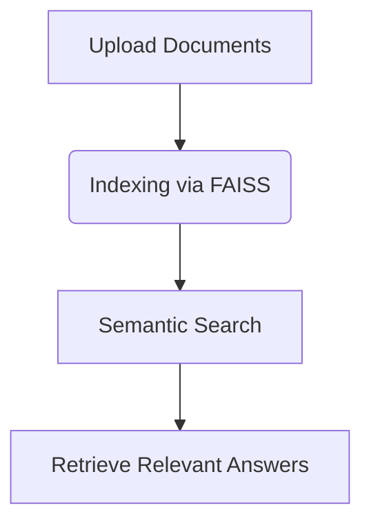

# OpenManus Local Knowledge Base Feature  

## Overview  
The **Local Knowledge Base** lets you add custom documents (like PDFs or Markdown files) to OpenManus, enabling AI-powered searches that understand context—not just keywords.  

## Key Functionalities

  
- **File Support**: Works with Markdown, PDFs, TXT, and CSV.  
- **Smart Search**: Finds relevant content using AI (no exact keywords needed).  
- **Easy Setup**: Create and manage knowledge bases in seconds.  

## Use Cases  
- **Developers**:  
  - Instantly find API docs or code snippets.  
  - Example: "Show me how to authenticate with the API."  
- **Support Teams**:  
  - Auto-answer customer questions using indexed manuals.  
- **Legal Teams**:  
  - Search contracts for terms like "termination clause."  

## Benefits  
- ⏱️ **Faster than manual searches**.  
- 🎯 **More accurate than keyword tools**.  
- 🛠️ **No coding required**.  

<!-- Optional: Add diagram here to show the workflow. -->


## For Developers: API Example
```python
# Example: Upload a document to OpenManus Knowledge Base
import requests
api_endpoint = "https://api.openmanus.com/knowledge_base/upload"
headers = {"Authorization": "Bearer YOUR_API_KEY"}
files = {"file": open("document.pdf", "rb")}
response = requests.post(api_endpoint, headers=headers, files=files)
print(response.json())
```

### Glossary
- **Semantic Search**: Finds results based on meaning, not just keywords.
- **FAISS**: Technology for fast search in large datasets.
